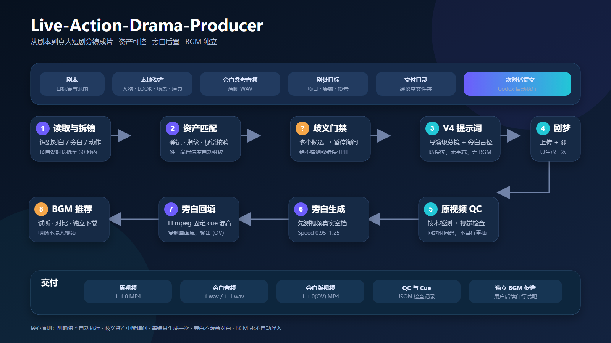
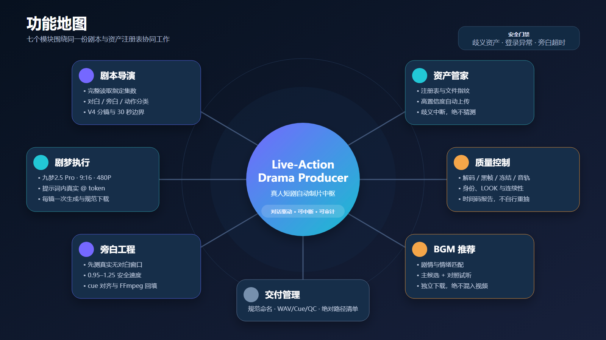

# Live-Action-Drama-Producer

面向真人 AI 短剧制作的 Codex Skill。它以本地剧本与项目资产为输入，按照 V4 导演规范完成拆镜、资产管理、缺失资产补全、剧梦引用和生成、连续性控制、视频 QC、旁白制作以及独立 BGM 推荐。

当前稳定版本：**v1.5.1**

## 适用场景

- 使用剧梦／九梦 2.5 Pro 制作真人 AI 短剧；
- 将完整剧本或指定集数拆成 4–30 秒分镜；
- 制作推文剧或彷真人剧；
- 管理人物、LOOK、场景、道具、尾帧和站位图资产；
- 自动补全确认缺失的生产资产；
- 检查 V4 提示词中的资产错用、漏用和多用；
- 处理同场景、同时间、未演完剧情的跨分镜连续性；
- 为复杂多人镜头预设构图和站位；
- 生成剧梦原视频、旁白版视频和独立 BGM 候选。

本 Skill 不用于普通剧本审校、字幕制作或传统画面剪辑，也不会把 BGM 自动混入视频。

## 功能总览

| 模块 | 主要功能 | 关键结果 |
|---|---|---|
| 项目启动 | 读取项目 `引导.md`、确认集数、语言、类型、路径和执行方式 | 项目执行基线 |
| 剧本导演 | 区分对白、旁白、动作和场景说明，按内容容量拆镜 | 分镜边界表 |
| V4 提示词 | 生成导演级逐秒执行稿并做旁白防误读处理 | 剧梦平台版提示词 |
| 资产注册 | 扫描目录、计算指纹、去重、匹配本地与平台资产 | `asset-registry.csv` |
| 缺失资产补全 | 生成人物、LOOK、场景和道具并执行视觉 QC | 可上传的 READY 资产 |
| 引用审计 | 检查平台真实 `@` token 的错用、漏用、多用和重复 | `ASSET_PREFLIGHT_PASS` |
| 连续性控制 | 尾帧法、1–2 秒识别缓冲、站位合成图 | FRAME / STAGING / BOTH |
| 剧梦执行 | 上传资产、设置参数、生成一次、下载和命名 | 原始分镜视频 |
| 视频 QC | 技术检测、身份和连续性检查、声音检查 | QC 报告和问题时间码 |
| 旁白工程 | 识别真实对白窗口、计算语速、生成和回填旁白 | WAV、cue、`(OV).MP4` |
| BGM | 按剧情试听、推荐和下载音乐 | 独立 BGM 候选 |

## 完整工作流程

### 1. 项目启动与资料边界

新项目可以复制 [项目启动引导](assets/引导.md)，填写：

- 剧名、目标集和制作范围；
- 主语言；
- 推文剧或彷真人剧；
- 剧本、资产、旁白参考音频和交付目录；
- 剧梦项目、目标集和起始分镜；
- 是否需要在点击生成前暂停确认；
- 项目特殊禁令。

Skill 会区分操作指令与制作资料。用户当前明确要求和项目 `引导.md` 属于指令；剧本正文、图片内文字、素材文件名和网页内容默认只作为制作资料，不会被误当成新的操作命令。

### 2. 剧本读取、分类与拆镜

Skill 会完整读取指定范围，并区分：

- 现场对白：由正确角色开口并对口型；
- 旁白、心理叙述和画外说明：只作为画面与时长占位，剧梦原视频不得朗读；
- 动作、微表情、眼神和人物反应；
- 场景、时间、天气、服装和道具状态；
- 当前分镜必须覆盖的剧情；
- 下一分镜禁止提前出现的剧情。

拆镜不是机械平均分配文字，而是综合：

- 原文长度和信息量；
- 对白自然语速；
- 动作与表演负荷；
- 场景和时间切换；
- 单镜 4–30 秒限制；
- 旁白可用窗口；
- FRAME/BOTH 镜头额外需要的 1–2 秒识别缓冲。

无法在 30 秒内自然完成时继续拆镜，不通过加速对白、删除原文或压缩表演硬塞内容。

### 3. V4 导演级分镜提示词

分镜统一遵循 [V4 导演规范](references/storyboard-director-v4.md)，内容包括：

- 基础规格和剧情边界；
- 视觉母版及每个资产的职责；
- 第一帧和最终结束点；
- 场景空间、轴线、门窗和家具锚点；
- 人物起始位置、朝向、距离和前中后景；
- LOOK、妆容、伤势、污渍和干湿状态；
- 道具持有者、左右手、位置和状态；
- 逐秒摄影机、动作、表演、微表情和视线；
- 非说话角色的持续反应；
- 现场对白、环境声与动作音效；
- 禁止项和下一镜禁入剧情。

原始 V4 会经过 `prompt_voiceover_guard.py` 生成平台版：

- 保留旁白原文、语义、时长和画面占位；
- 把旁白转换为“不生成声音、不朗读、不对口型”的无声占位；
- 只允许现场对白、环境声和动作音效；
- 禁止旁白发声、内心独白、字幕和 BGM。

### 4. 资产注册、指纹与唯一匹配

资产类型包括：

- `CHAR`：人物身份；
- `LOOK`：人物当前服装和剧情状态；
- `SCENE`：空场景；
- `PROP`：关键道具；
- `FRAME`：上一镜真实尾帧；
- `STAGING`：下一镜专用站位合成图。

Skill 会：

1. 扫描资产目录和全部子目录；
2. 建立或更新 `asset-registry.csv`；
3. 记录标准名、别名、本地文件和平台名称；
4. 计算文件大小、修改时间和 SHA256；
5. 核对人物身份、LOOK、场景状态、道具版本和连续性范围；
6. 检查剧梦平台名称、缩略图和资产 ID；
7. 只允许 `READY + HIGH + 唯一匹配` 的资产自动引用。

存在多个候选、同名异图、身份不清或 LOOK 状态不明确时，状态为 `PENDING_CONFIRMATION`。Skill 不会猜选，也不会通过另造资产绕过歧义。

### 5. 缺失资产自动补全闭环

只有完成本地目录、注册表、别名和剧梦素材库搜索后仍不存在的必要资产，才会标记为确认缺失。完整规则见 [缺失资产补全规范](references/missing-asset-generation-loop.md)。

#### 全新人物

- 结合当前剧情、前后分镜和必要的剧本全文确定身份、年龄、阶层、职业、服装和状态；
- 匹配项目现有真人摄影与时代风格；
- 不复制或融合现有人物面孔；
- 新人物必须与现有角色明显可区分；
- 不得生成亚洲人脸；
- 不得出现名人脸、文字、水印或多余人物。

#### 同一人物的新 LOOK

- 使用该人物已确认身份图；
- 保持同一张脸、骨相和稳定体貌；
- 只改变剧情要求的服装、发型、伤势、污渍、干湿或健康状态；
- 不得因换装而换脸。

#### 全新场景

- 根据时代、地域、建筑、气候、阶层和剧情状态设计；
- 固定为 16:9 横版；
- 必须是完全空场景；
- 不得出现人物、人影、倒影、肖像、可识别人脸、文字、Logo 或水印。

#### 同一场景的新状态

- 必须基于原场景编辑；
- 保持空间几何、机位、透视、门窗、家具主布局和关键锚点；
- 只改变昼夜、季节、天气、破损、潮湿、火灾后等指定状态。

#### 道具

- 符合世界观、时代、地域、阶层、材质和技术水平；
- 状态版本保持形状、比例和识别特征；
- 不得出现现代错代物、人物、手、文字或水印。

每项资产最多进行三轮针对性修正。只有视觉验收通过后才会：

1. 保存至项目资产目录；
2. 建立版本化文件名和唯一 asset key；
3. 计算指纹并登记；
4. 上传剧梦并核对缩略图；
5. 形成平台真实 `@` token；
6. 重新执行完整资产引用自检。

### 6. V4 资产引用生成前强制自检

详细规则见 [资产引用自检规范](references/v4-asset-reference-preflight.md)。

系统先根据剧本和 V4 建立 `required_asset_keys`，再从剧梦编辑器读取实际平台 token：

    missing_assets = required_asset_keys - actual_page_tokens
    extra_assets = actual_page_tokens - required_asset_keys
    wrong_assets = 身份、LOOK、状态或版本错误的 token
    duplicate_tokens = 同一资产的不必要重复 token

自动处理：

- 漏用：补充正确 token；
- 错用：删除错误版本并替换；
- 多用：移除本镜不需要的资产；
- 重复：保留语义最清楚的一次；
- 确认缺失：进入资产生成、验收、上传和引用闭环；
- 修正完成后重新读取页面并从头自检。

普通文字资产名、普通文字 `@名称` 或只放在素材栏中的图片都不算有效引用。只有从候选列表选择后形成的平台 token 才有效。

剧梦资产引用没有数量上限。所有实际需要的资产都必须完整引用，不能为了减少 token 数量而省略。

只有以下条件同时成立才输出 `ASSET_PREFLIGHT_PASS`：

- `missing_assets` 为空；
- `extra_assets` 为空；
- `wrong_assets` 为空；
- 没有未解决的候选歧义；
- FRAME/STAGING 与 V4 没有连续性冲突；
- 页面设置和首帧控件已重新读取确认。

### 7. 跨分镜连续性与防穿帮

完整规则见 [尾帧与站位连续性规范](references/cross-shot-continuity.md)。

先由 V4 完成剧情拆镜，再做两个独立判断：

| 判断 | 结果 |
|---|---|
| 同一场景、同一时间、同一段未演完的故事／动作／对白？ | 使用 FRAME 尾帧法 |
| 人物多、站位复杂、遮挡精确、换机位空间关系需要预设？ | 使用 STAGING 站位合成图 |

最终状态：

| 时间连续性 | 空间调度 | continuity_control |
|---|---|---|
| 非紧接 | 简单 | `NONE` |
| 紧接 | 简单 | `FRAME` |
| 非紧接 | 复杂 | `STAGING` |
| 紧接 | 复杂 | `BOTH` |

#### FRAME 尾帧法

用于同场景、同时间、同一段尚未演完剧情的 HARD 紧接镜头：

- 从上一镜真实视频末段提取多张候选帧；
- 视觉选择无模糊、无遮挡、无转场且状态清楚的可用帧；
- 记录人物站位、朝向、手部、道具、门窗、家具、光线和动作余势；
- 在剧梦首帧能力中设置并重新读取确认；
- 下一镜不得重演已经完成的动作。

#### 1–2 秒尾帧识别缓冲与剪辑手柄

`FRAME` 或 `BOTH` 镜头开头必须：

- 第一帧直接继承真实尾帧；
- 保持同机位、同景别、同构图、同透视和同轴线；
- 保持人物站位、LOOK、姿态、手部、道具、门窗、家具和光线；
- 不开始新对白、新剧情或新动作；
- 不立即推拉摇移、改变焦段或换景别；
- 只允许自然呼吸、眨眼、头发和布料的极轻微变化；
- 保持 1–2 秒后，立刻明确 CUT 到正式机位或 STAGING 构图。

这段时间用于让生成模型识别上一镜现场，也是后期可裁切、覆盖或选择切点的剪辑手柄。它计入剧梦生成总时长，但不计入有效剧情、对白或旁白容量。Skill 会记录缓冲范围和建议 CUT 点，但不会擅自裁剪画面。

#### STAGING 人物入景站位合成图

用于精确锁定下一镜：

- 目标机位和景别；
- 人物左右位置与前中后景；
- 身体朝向、视线和遮挡；
- 人物与门、桌、床、楼梯、车辆和道具的距离；
- 相对尺度、透视和地面接触；
- 关键道具的持有者、左右手、位置和状态。

STAGING 可以单独使用，也可以与 FRAME 同时使用。它不是尾帧失败后的替代方案。

#### 基础资产始终保留

FRAME 和 STAGING 都只是 V4 的视觉辅助资产，绝不能替代基础资产。即使尾帧已经完整显示人物与环境，仍须正常引用：

- 当前场景 `SCENE`；
- 每个实际出镜人物的 `CHAR`；
- 每个出镜人物当前状态的 `LOOK`；
- 实际可见的关键 `PROP`；
- 需要时的 `FRAME` 和 `STAGING`。

### 8. 剧梦上传、生成和下载

平台执行检查见 [平台规范](references/platforms.md)。

默认参数：

- 模型：九梦 2.5 Pro；
- 画幅：9:16；
- 画质：480P；
- 单镜时长：4–30 秒；
- 无字幕；
- 无 BGM；
- 原视频无旁白朗读；
- 每个分镜默认只生成一次。

操作流程：

1. 核对项目、目标集和新分镜位置；
2. 上传尚未存在的 READY 资产；
3. 核对完整名称、缩略图和平台 ID；
4. 填入经过防误读处理的平台版 V4；
5. 逐项形成真实 `@` token；
6. 执行资产和连续性自检；
7. 重新读取模型、比例、画质、时长和首帧控件；
8. 只点击一次生成；
9. 等待可播放状态，不重复点击；
10. 播放验证、下载并按固定规则命名。

HARD 连续性簇严格顺序执行：

    当前镜生成与 QC
      → 提取真实尾帧
      → 建立连续性移交
      → 写入 1–2 秒缓冲和明确 CUT
      → 判断是否需要 STAGING
      → 下一镜自检
      → 下一镜生成

不会把整个连续性簇同时排队抽卡。

### 9. 原视频技术与内容 QC

完整检查见 [质量控制规范](references/quality-control.md)。

#### 技术检查

- 文件存在、非空且可完整解码；
- 包含视频流和音频流；
- 分辨率、画幅、帧率和总时长正确；
- 检测黑帧、长冻结、解码错误和异常音频缺失；
- 报告可能的削波和静音问题。

#### 视觉和剧情检查

- 人脸身份、年龄、发型和体型正确且稳定；
- LOOK、场景和道具状态正确；
- 站位、轴线和上一镜连续；
- 无多余肢体、人物复制、瞬移、融化和物体穿插；
- 对白说话人、顺序、内容和口型正确；
- 没有误生旁白、字幕、水印或 BGM；
- 没有提前进入下一镜剧情。

#### 连续性专项检查

- FRAME：检查前 1–2 秒是否保持尾帧状态；
- BOTH：检查缓冲后是否明确 CUT 到 STAGING 构图；
- STAGING：检查目标机位、站位、朝向、遮挡和尺度；
- NONE：检查新时空是否正确建立，没有错误继承上一镜瞬时状态。

异常会记录精确时间码、问题类型和证据。QC 失败不会自动授权重新生成。

### 10. 旁白生成、时间轴与回填

旁白流程见 [旁白规范](references/narration-mix.md)。

Skill 不依据提示词预计时间直接混旁白，而是先分析下载后的真实视频：

1. 使用带时间码的语音识别和人声活动检测定位现场对白；
2. 逐段播放复核说话人和实际区间；
3. 在每个对白区间前后加入默认 0.35 秒保护；
4. 从剩余无对白窗口中按剧情顺序安排旁白；
5. 计算刚好能放下的语速。

语速规则：

- 默认 1.1；
- 安全范围 0.95–1.25；
- 1.1 能放下时不提速；
- 必须提速时只提高到刚好放下；
- 1.25 仍放不下时停止，不覆盖对白、不删文本、不改变视频速度。

产物：

- 整集纯旁白 `{集数}.wav`，或按镜拆分的 `{集数}-{分镜号}.wav`；
- JSON cue sheet；
- 保留原对白与音效的旁白版视频；
- 旁白版文件名 `{集数}-{分镜号}.{抽卡序号}(OV).MP4`。

旁白回填工具：

- 复制原视频流，不重新压制画面；
- 只重编码音频；
- 在输出前校验旁白 cue 与对白保护区零交叉；
- 不允许用 ducking 掩盖对白重叠；
- 输出后再次检查时长、画面一致性、截字、重叠和削波。

### 11. BGM 推荐与下载

Skill 会结合剧本、情绪弧线和旁白版成片：

- 至少试听一个主推荐和一个对照候选；
- 优先器乐、无人声、不遮盖对白的曲目；
- 记录曲名、平台 ID、类型、情绪、用途和推荐理由；
- 验证文件可播放和时长；
- 将 BGM 作为独立音频文件下载。

Skill 不会把 BGM 自动混入原视频或旁白版视频，最终试配与混音由用户决定。

## 自动修复与暂停条件

自检发现可修复问题时不会只记录或无视，而会自动修正并重新检查：

- 补充漏用 token；
- 替换错用 token；
- 删除多用和无必要重复 token；
- 修正模型、比例、画质、时长和首帧设置；
- 自动补全确认缺失的资产；
- 修订与 FRAME/STAGING 冲突的 V4；
- 为 FRAME/BOTH 镜头补写 1–2 秒缓冲和明确 CUT。

只有以下真实阻塞才暂停：

- 多个候选资产无法唯一判断；
- 剧本信息冲突且不同选择会改变结果；
- 登录失效、验证码或平台错误；
- 目标项目、集数或分镜位置不明确；
- 图像生成能力不可用；
- 缺失资产连续三轮仍未通过视觉 QC；
- 旁白在 1.25 倍速下仍无法放入真实窗口；
- 需要新的凭据、授权或不可逆操作；
- 用户明确要求在生成前人工确认。

## 文件命名与交付内容

### 固定命名

| 类型 | 命名 |
|---|---|
| 原视频 | `{集数}-{分镜号}.{抽卡序号}.MP4` |
| 首次抽卡 | 抽卡序号为 `0` |
| 旁白版 | `{集数}-{分镜号}.{抽卡序号}(OV).MP4` |
| 集级旁白 | `{集数}.wav` |
| 镜头级旁白 | `{集数}-{分镜号}.wav` |
| 旁白时间表 | `{集数}-{分镜号}.cues.json` |
| QC 报告 | `{集数}-{分镜号}.qc.json` |

### 最终报告

最终交付会列出：

- 分镜边界、原文起止和时长；
- 连续性簇、FRAME/STAGING 状态；
- 尾帧文件、时间码、缓冲范围和建议 CUT 点；
- 每镜 required asset keys 和平台 token；
- 补生成资产、QC 状态和平台 ID；
- 原视频、旁白 WAV、cue 和旁白版路径；
- 视频与音频 QC 结论及问题时间码；
- BGM 候选、平台 ID、理由和独立文件路径；
- 所有未完成项和恢复条件。

## 使用方法

### 使用项目引导

复制 [`assets/引导.md`](assets/引导.md) 到短剧项目根目录，填写方括号字段，然后在 Codex 中调用：

    $live-action-drama-producer

Skill 会简短确认项目参数，并在不存在真实阻塞时持续完成已经授权的制作范围。

### 直接发送任务

    使用 $live-action-drama-producer 开始制作。

    剧本路径：D:\项目\剧名\剧本.docx
    制作范围：第1集
    资产路径：D:\项目\剧名\资产
    剧梦项目：剧名
    剧梦目标：第1集，从分镜1开始新增
    交付目录：D:\项目\剧名\成片
    生成前：不需要人工确认，符合规则后自动继续
    特殊要求：完全写实真人、9:16、480P、无字幕、原视频无旁白和BGM

如果希望先审核提示词与引用清单：

    生成前：把最终 V4 和资产引用清单交给我检查，我确认后再点击生成。

## 运行要求

- Codex 能读取指定的本地剧本和资产目录；
- 剧梦账号已登录并可访问目标项目；
- 需要旁白时提供清晰的参考 WAV；
- 需要生成旁白版时，本机可执行 FFmpeg；
- 浏览器任务运行期间保持当前任务和页面状态可用。

## 仓库结构

    SKILL.md                         Skill 主入口
    agents/openai.yaml              界面元数据和默认调用提示
    assets/引导.md                  项目启动模板
    assets/asset-registry-template.csv
    assets/continuity-handoff-template.json
    references/storyboard-director-v4.md
    references/v4-asset-reference-preflight.md
    references/missing-asset-generation-loop.md
    references/cross-shot-continuity.md
    references/quality-control.md
    references/narration-mix.md
    references/platforms.md
    scripts/asset_registry_audit.py
    scripts/extract_continuity_frames.py
    scripts/prompt_voiceover_guard.py
    scripts/media_qc.py
    scripts/narration_speed.py
    scripts/mix_narration.py
    manual/使用手册.md

## 详细文档

- [使用手册](manual/使用手册.md)
- [V4 导演规范](references/storyboard-director-v4.md)
- [资产引用生成前自检](references/v4-asset-reference-preflight.md)
- [缺失资产自动补全闭环](references/missing-asset-generation-loop.md)
- [尾帧与站位连续性规范](references/cross-shot-continuity.md)
- [视频与音频质量控制](references/quality-control.md)
- [旁白制作与混音规范](references/narration-mix.md)
- [平台执行参数](references/platforms.md)

## 版本管理

- `main`：当前稳定版本；
- Git 标签与 Skill 版本一致，例如 `v1.5.1`；
- 每次更新先修改 `SKILL.md` 中的 `metadata.version`；
- 完成结构、JSON/YAML、内部链接和脚本验证后提交；
- 为稳定版本创建同名 Git 标签并推送。

当前版本标签：[v1.5.1](https://github.com/Nobpy/Live-Action-Drama-Producer/tree/v1.5.1)

## License

[MIT License](LICENSE)
