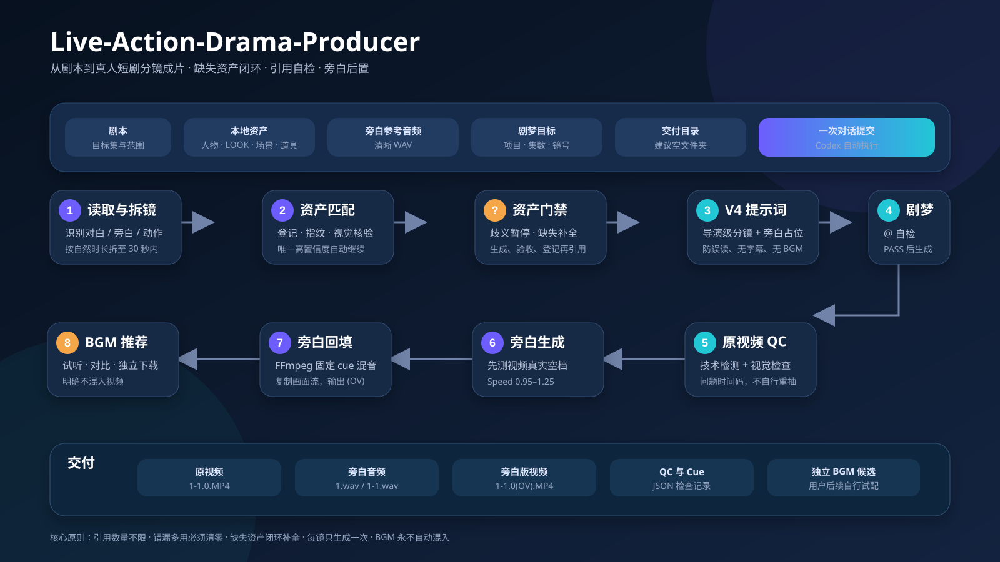
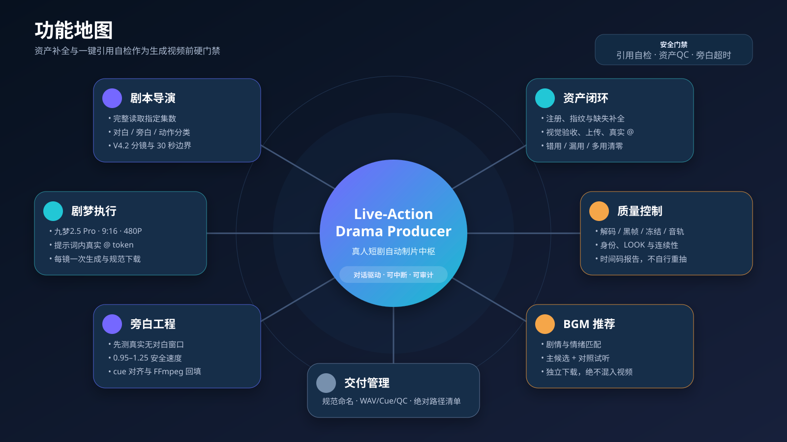

# Live-Action-Drama-Producer 使用手册与功能说明

> 版本：v1.5.1  
> 适用对象：AI 真人短剧制作者、第一次使用 Codex 自动制片流程的新手  
> 调用名称：`$live-action-drama-producer`



## 一句话说明

你准备好剧本、已有的人物/服装/场景/道具图片和旁白参考音频，然后告诉 Codex 文件路径与剧梦目标项目。本 Skill 会完成：读剧本、拆分镜、识别本地资产、按剧本和现有风格补全确实缺失的必要资产、生成 V4 分镜提示词、用尾帧与人物入景站位合成图辅助连续性和复杂调度、检查错用/漏用/多用、在剧梦上传并 `@` 引用资产、生成原视频、制作并回填旁白、做质量检查，以及推荐和下载独立 BGM。

缺失资产只在当前制作范围确有需要且全目录与平台均找不到时补生成，不会擅自替换已有可用资产。它不做画面剪辑，不生成字幕，也不会把 BGM 自动混进视频。

## 开始前需要准备什么

### 1. 必备材料

| 材料 | 说明 | 示例 |
|---|---|---|
| 完整剧本 | Markdown、TXT 等可读取文本 | `D:\项目\剧名\剧本.md` |
| 资产文件夹 | 已有人物、LOOK、场景、关键道具图；允许缺少少量剧情必需资产 | `D:\项目\剧名\资产` |
| 旁白参考音频 | Voice Clone 使用的清晰 WAV | `D:\项目\剧名\音频\reference.wav` |
| 成片交付文件夹 | 建议每次提供空文件夹 | `D:\项目\剧名\成片` |
| 剧梦目标位置 | 项目名、目标集、起始镜头号 | 项目“某某短剧”第 1 集镜头 1 |

### 2. 网页与软件状态

- 剧梦已经登录：<https://jzzm.duanju.com/homepage>
- Voice Clone 页面能够访问：<http://112.27.96.227:9015/?lang=python>
- BGM 曲库能够访问。
- Codex 可以控制浏览器并读取你指定的本地文件。
- 需要生成 `(OV)` 旁白版视频时，本机必须有可执行的 FFmpeg；可加入系统 `PATH`，或把明确路径交给 Codex。

### 3. 资产文件怎么放

新手不需要手工填写复杂字段。建议只把文件按类别分文件夹，并用能认出的名称：

```text
资产/
├─ 人物/
│  ├─ Mara.png
│  └─ Jace.png
├─ 服装/
│  ├─ Mara_EP01_礼服.png
│  └─ Jace_EP01_黑西装.png
├─ 场景/
│  └─ 家族大厅_白天.png
└─ 道具/
   └─ 身份鉴定书.png
```

Codex 会建立机器使用的 `asset-registry.csv`。文件名明确、视觉内容正确且只有一个候选时自动继续；看不出该用哪个资产时会停下来问你，不会自行猜测。完成全目录、别名和剧梦素材库搜索后仍不存在的必要资产，会进入自动补全和视觉验收流程。

## 最简单的使用方法

### 使用项目级 `引导.md`

Skill 自带 [引导模板](../assets/引导.md)。建议把它复制到具体短剧项目根目录，填写剧名、目标集、主语言、制作类型、剧本与资产路径、剧梦位置和交付目录。之后把该文件交给 Codex，即可统一每次任务的身份、优先级、自动修复和完成标准。

启动后 Codex 会简短确认任务并立即开始，不会停在计划等待你再次说“继续”。资产引用自检发现错用、漏用、多用或确认缺失时，会先按 Skill 自动修正、补资产并重新自检；只有真正无法自动消除的歧义或外部阻塞才会暂停。

### 直接发送任务模板

把下面模板复制给 Codex，替换路径和项目名称：

```text
使用 $live-action-drama-producer 开始制作。

剧本路径：D:\项目\剧名\剧本.md
制作范围：第1集
资产路径：D:\项目\剧名\资产
旁白参考音频：D:\项目\剧名\音频\reference.wav
剧梦项目：剧名
剧梦目标：第1集，从镜头1开始新增
交付目录：D:\项目\剧名\成片
生成前：不用让我检查，符合规则就直接生成
特殊要求：完全写实真人、9:16、480P、无字幕、原视频无旁白和BGM
```

如果你希望先看提示词，把“生成前”改成：

```text
生成前：把最终提示词和资产引用清单给我检查，我确认后再点击生成
```

## 自动流程会做什么

### 第 1 步：读取剧本并拆分镜

Codex 完整读取指定范围，区分：

- 角色现场对白：由剧梦视频中的角色说出并对口型；
- 旁白或心理叙述：视频里只留时间，不在剧梦中读出；
- 动作、表情、场景和道具说明：只用于画面生成。

每条视频最长 30 秒。内容过多时自动拆成更多分镜，不会强行加速角色对白。

### 第 2 步：识别并登记本地资产

Codex 扫描资产目录，为人物、LOOK、场景和关键道具建立唯一记录，并计算文件大小、修改时间和 SHA256 指纹。

资产判断有三种结果：

- `READY`：名称、类型、视觉和连续性都明确，且只有一个候选，可以自动上传引用。
- `PENDING_CONFIRMATION`：存在多个候选、服装状态不清、同名不同图或 Codex 无法判断。此时会列出问题并暂停，等你指定。
- `MISSING`：完成本地、注册表、别名和平台搜索后仍不存在。默认进入缺失资产补全，不会直接删掉该项需求。

资产图片被替换或内容变化后会重新检查，避免继续引用剧梦中的旧资产。

### 第 3 步：补全确实缺失的资产

缺失项会先按“全新人物、同一人物新 LOOK、全新场景、同一场景新状态、全新道具、同一道具新状态”分类，再结合当前剧情、前后分镜、必要的剧本全文和项目现有资产建立需求说明。

- 新人物保持项目真人写实与时代风格，但不得复制或近似现有人物面孔，也不得出现亚洲人脸；
- 同一人物的新 LOOK 必须保留身份，只改变服装或剧情状态；
- 场景统一为 16:9 空场景，不得出现人物、文字、Logo 或水印；
- 同一场景的新状态基于原图编辑，保持空间几何、机位、门窗和主布局；
- 道具必须符合剧本世界观、时代、阶层和技术水平。

每张图都会实际查看验收。单项最多三轮针对性修正，仍不合格就暂停本镜，绝不会把失败图上传引用。通过后才保存到项目资产目录、写入注册表、上传剧梦并加入当前分镜需求集合。

### 第 4 步：生成 V4 分镜提示词

提示词只使用随 Skill 固定的 V4 导演规范。旁白原文会作为画面节奏和时间占位保留，但经过防误读处理：

```text
旁白占位（不生成声音，不朗读，不对口型）
```

剧梦音轨只允许现场对白、环境声和动作音效。提示词明确禁止旁白发声、内心独白、画外解说、字幕和 BGM。

### 第 4.1 步：按 V4 判断连续性辅助

V4 先确定每个分镜的剧情边界、时空关系和下一镜镜头设计，然后分别判断：

- 如果下一镜是同一场景、同一时间、同一段尚未演完的故事、动作或对白，就从上一镜真实视频选取可用尾帧，辅助 V4 无缝承接；
- 如果已切到下一天、其他场景、其他时空或新段落，则不使用上一镜尾帧；
- 如果下一镜人物多、站位/遮挡/前中后景复杂或换机位后空间关系必须精确，就制作人物入景站位合成图辅助 V4；
- 紧接且站位复杂时，尾帧和站位合成图同时使用：前者锁真实尾态，后者锁下一镜目标构图。

因此站位合成图不是尾帧失效后的补救，两种方法也不替代 V4。系统会记录 `NONE / FRAME / STAGING / BOTH` 并在生成前检查三者是否一致。

使用 `FRAME` 或 `BOTH` 时，下一镜开头会专门预留 1–2 秒尾帧识别缓冲：先保持与上一镜结尾相同的机位、构图、站位、人物/道具状态和光线，不开始新对白、新剧情或明显运镜；随后立刻明确 CUT 到正式机位或 STAGING 构图。这段不是给观众看的有效剧情，而是帮助模型识别上一镜现场、并为你后期裁切或选择切点留下的剪辑手柄。

这 1–2 秒计入剧梦生成总时长，因此拆镜时会提前留量，不会挤压对白、旁白占位和后续剧情。Skill 不会自动裁掉它，而会在交付记录中标明实际缓冲范围与建议 CUT 点。

尾帧只负责连续性，不替代资产。使用尾帧时仍然完整引用本镜场景、全部出镜人物、当前 LOOK 和实际可见关键道具，避免人物身份、服装或场景本体只靠一张尾帧猜测。

### 第 5 步：上传、引用并执行生成前自检

没有上传过的明确资产会先上传到剧梦。之后每个实际使用的资产都必须在提示词内输入 `@`，再从候选列表中点击选择，形成平台可识别的资产标签。

仅仅把图片放进普通资产栏，或者输入普通文字 `@Jace`，都不算引用成功。剧梦引用数量没有上限，所有实际需要的资产都必须绑定，不能为了减少 token 数量而省略。

生成前会建立当前分镜的 `required_asset_keys`，并与页面唯一 token 集合逐项比较：

```text
missing_assets = required_asset_keys - 页面token
extra_assets = 页面token - required_asset_keys
wrong_assets = 身份、LOOK、状态或版本错误的token
```

发现漏用会补引用，错用会替换，多用会移除；发现确实缺失会回到第 3 步补资产。修正后必须重新读取页面再检查。只有三类问题和未确认歧义全部为零，才能进入视频生成参数检查。

### 第 6 步：生成和下载原视频

默认参数：

- 模型：九梦2.5 Pro
- 画幅：9:16
- 画质：480P
- 时长：4–30 秒，由分镜内容决定
- 每个分镜只生成一次

原视频命名：

```text
1-1.0.MP4   第1集分镜1，第1次生成
1-2.0.MP4   第1集分镜2，第1次生成
2-1.0.MP4   第2集分镜1，第1次生成
```

`.0` 表示第一次抽卡；如果你后来明确要求第二次生成，才使用 `.1`。

### 第 7 步：原视频质量检查

系统会检查文件是否可解码、分辨率、时长、黑帧、长冻结、异常静音和可能削波；同时观看人物身份、服装、场景、道具、站位、对白和连续性。使用 FRAME 或 BOTH 时，会检查下一镜开头 1–2 秒是否保持尾帧状态、是否误入对白/剧情、是否发生机位漂移，以及缓冲后是否明确 CUT；使用 STAGING 时检查 CUT 后的目标构图和站位。

发现穿帮、错误人物、误生旁白、字幕、BGM 或提前演出下一镜时，会报告时间码和问题。因为规则是“一镜只生成一次”，不会擅自重新抽卡。

### 第 8 步：根据真实视频制作旁白

先看生成的视频，标记现场对白和无对白窗口，再计算旁白速度，而不是只按剧本估计。

- 默认速度：1.1
- 安全范围：0.95–1.25
- 1.1 能放下就保持不变
- 需要提速时只提高到刚好放下
- 1.25 仍放不下就暂停报告，不覆盖对白、不删句、不改变视频速度

默认可以生成整集 `{集数}.wav`；如果不同分镜需要完全不同的速度，则改为 `{集数}-{分镜号}.wav`。

### 第 9 步：回填旁白并输出 OV 视频

FFmpeg 按 cue sheet 把旁白放入对应无对白窗口，只重新编码音频，尽量原样复制视频流。旁白出现时可轻微压低不含对白的环境底声，但不会清除原对白与合理音效。

```text
原视频：1-1.0.MP4
旁白版：1-1.0(OV).MP4
```

原视频、原始 WAV 和 cue sheet 都会保留。

### 第 10 步：推荐并下载 BGM

系统结合剧情和旁白版成片选择音乐，至少试听一个主推荐和一个对照候选，优先无主唱、不盖对白的器乐曲。

BGM 只作为独立文件下载，并记录曲名、平台 ID、类型和推荐理由。**系统不会把 BGM 混入视频**，由你后续自行试配。

## 功能总览



| 模块 | 自动完成 | 需要你介入的情况 |
|---|---|---|
| 剧本导演 | 拆镜、对白/旁白识别、V4 提示词 | 剧本范围或目标集不明确 |
| 资产管家 | 注册、指纹、缺失资产补全、视觉验收、上传与 `@` 引用 | 多个候选或视觉无法判断 |
| 引用审计 | 检查错用、漏用、多用并自动修正，PASS 后才放行 | 候选存在歧义或生成资产三轮仍失败 |
| 剧梦执行 | 设置参数、生成一次、下载命名 | 登录、验证码、平台错误 |
| 旁白工程 | 测窗口、算速度、Voice Clone、回填 | 速度 1.25 仍放不下 |
| 质量控制 | 技术检测、视觉连续性、问题时间码 | 是否接受有疑点的结果 |
| BGM 推荐 | 匹配、试听、下载、登记 | 最终采用哪首、如何混音 |

## 系统什么时候会暂停询问

以下情况属于必要中断，不是运行失败：

1. 一个角色或场景对应多个相似资产，无法唯一选择；
2. 文件名与图片内容不一致，或同一人物有多套 LOOK；
3. 缺失资产连续三轮生成或验收仍失败，或图像生成能力不可用；
4. 剧梦出现同名但不同缩略图的资产；
5. 项目、目标集或分镜编号不明确；
6. 登录失效、验证码或平台报错；
7. 旁白在 1.25 倍速下仍无法放入无对白窗口；
8. 用户要求生成前检查，尚未明确批准。

你只需针对问题给出明确答案，流程会从中断点继续。

## 最终会得到哪些文件

```text
交付目录/
├─ 1-1.0.MP4          # 剧梦原视频：对白+同期音效，无旁白/BGM
├─ 1-1.0(OV).MP4      # 加入旁白后的版本
├─ 1.wav              # 本集纯旁白，或按镜拆分的 WAV
├─ 1-1.cues.json      # 旁白来源和落点时间表
├─ 1-1.qc.json        # 技术 QC 报告
└─ BGM候选音频.*      # 独立下载，不混入视频
```

实际交付记录还会列出每个分镜的剧情边界、使用资产、旁白速度、QC 状态、BGM 平台 ID 和未完成项。

## 常见问题

### 为什么 Codex 突然停下来问资产？

因为资产存在歧义，而不是单纯缺失。歧义资产不能通过另造一张图来绕过；该规则专门防止错误人物、错误服装或错误场景被上传引用。明确选择后即可继续。确认确实缺失的资产默认会自动补全，只有生成或验收失败才暂停。

### 为什么提示词里写了资产名，系统仍然说漏用？

因为普通文字名称不等于剧梦平台 token。必须在提示词中输入 `@`，从候选列表选中正确资产并形成标签。生成前自检读取的是页面真实 token，不是文字相似度。

### 使用尾帧后，还需要引用人物和场景资产吗？

需要。尾帧的职责是让模型继承上一镜真实结束时的环境、站位、状态和动作余势，不是人物或场景的完整身份母版。场景、全部出镜人物、当前 LOOK 和关键道具仍要分别形成真实 `@` token；缺少任何必要基础资产都不能通过自检。

### 为什么尾帧续接镜头开头有 1–2 秒几乎不推进剧情？

这是专门保留的模型识别缓冲和后期剪辑手柄。它让模型先稳定继承上一镜，再在明确 CUT 后进入正式镜头；你可以在剪辑时裁掉、覆盖或利用这段选择切点，避免两段视频直接硬接造成闪帧或跳帧。

### 注册表是不是要我自己填写？

通常不用。Codex 会从本地文件和剧本建立注册表。你主要负责在它无法判断时确认哪个文件对应哪个角色、LOOK 或场景。

### 为什么原视频没有旁白？

这是正确结果。剧梦原视频只生成角色对白和同期音效，旁白先作为无声占位，等视频完成后根据真实空档单独生成并回填。

### 能不能自动多生成几版让我选？

默认不能。每镜只生成一次，避免无授权消耗。需要第二次抽卡时，你应明确指出具体分镜和修改要求。

### 为什么 BGM 没有出现在 `(OV)` 视频里？

这是设计要求。曲库推荐可能需要人工多次试配，所以 Skill 只下载候选，不自动混音。

### FFmpeg 找不到怎么办？

告诉 Codex 已安装的 `ffmpeg.exe` 绝对路径，或把 FFmpeg 加入系统 `PATH`。之前临时依赖路径被清理时，需要重新恢复为稳定位置。

### 可以中途关闭任务吗？

不建议。浏览器生成、下载和本地对齐需要保持任务运行；关闭后页面状态和未记录的中间步骤可能需要重新核对。

## 推荐的第一次测试

不要第一次就跑完整剧。选择一集中的一个 15–30 秒分镜，并准备：1 个场景、1–2 个人物、对应 LOOK、少量旁白。先验证资产 `@` token、原视频音轨、文件命名和 `(OV)` 对齐，再扩大到整集。

完成单镜测试后可以直接说：

```text
继续使用 $live-action-drama-producer，按照刚才确认的资产注册表制作下一分镜。
```
